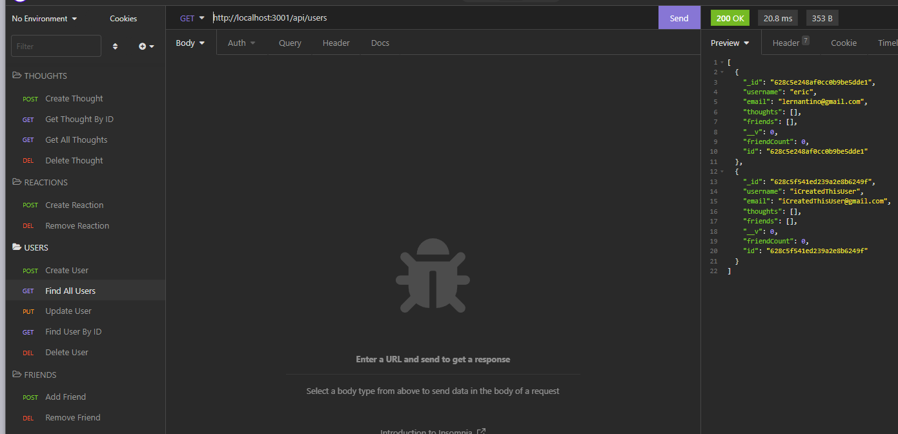

# Social-NetworkAPI
#
## Video Walkthrough

Video Link - https://drive.google.com/file/d/12tQbDAVtBk_S5zAS031OrNXVqzX2PgLz/view

## Description
This is a Social Media API where users can create, find, update, or delete users . As well as add other users as friends or delete and also add thoughts to each user! This application is all back-end and was built with Mongoose.
#
## Badges
  
#
## Visuals

 Gets All Users

 

 Deletes a User By ID

 

 Creates a Thought 

#

## Installation

1. npm init -y

2. npm install

#

## Usage

1. npm start

## License
[MIT](./license.md)
